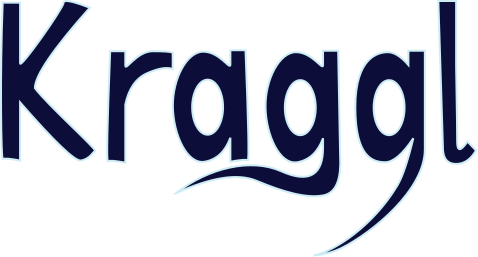

Connect your Glo Board projects to your Toggl account and never forget to track your time again.
With detailed time entry descriptions and tags depending of the state your task is in, Kraggl allows you to combine the power of Glo Boards as a project management tool with Toggl and it's professional reporting tools.

## Getting started

Head over to [Kraggl](https://kraggl.com).

Or get the Express server running locally:

- Create a new [Glo App](https://app.gitkraken.com/oauth_apps)
- Clone this repo
- `npm install` to install all required dependencies
- `GIT_KRAKEN_CLIENT_ID="CLIENT_ID OF YOUR NEW GLO APP" GIT_KRAKEN_CLIENT_SECRET="CLIENT_SECRET OF YOUR NEW GLO APP" npm start` to start the local server

Go to `localhost:3000` to view the Kraggl homepage.

## Deployment

A `Dockerfile` is provided and can be used in a `docker-compose` setup.

Example `docker-compose` service:

```YAML
kraggl:
    image: lichtblau/kraggl:latest
    environment:
        GIT_KRAKEN_CLIENT_ID: "YOUR CLIENT_ID"
        GIT_KRAKEN_CLIENT_SECRET: "YOUR CLIENT_SECRET"
    volumes:
        - kraggl-data:/usr/src/app/database
```

And don't forget to add the volume to persist the SQLite database:

```YAML
volumes:
  kraggl-data:
```

## Build with

* [Toggl API](https://github.com/7eggs/node-toggl-api)
* [Glo Board API](https://github.com/mlichtblau/glo-board-api-node)

## Contributing

Please read [CONTRIBUTING.md](CONTRIBUTING.md) for details on our code of conduct, and the process for submitting pull requests to us.

## Authors

* **Marius Lichtblau** - [mlichtblau](https://github.com/mlichtblau) - [lichtblau.io](https://lichtblau.io) - [@lichtblau](https://twitter.com/lichtblau) - [marius@lichtblau.io](mailto:kraggl@lichtblau?subject=Kraggl%Request)
* **Annika Baldi** - [bisbaldi](https://github.com/bisbaldi)

## License

This project is licensed under the MIT License - see the [LICENSE.md](LICENSE.md) file for details
